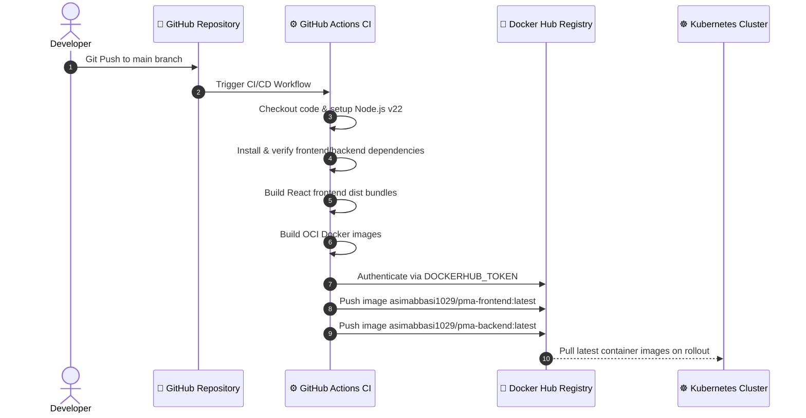

# 🚀 PMA - Enterprise Project Management Application

[](https://github.com/asimabbasi1029/PMA/actions/workflows/build.yml)
[](https://hub.docker.com/r/asimabbasi1029/pma-backend)
[](https://hub.docker.com/r/asimabbasi1029/pma-frontend)
[](https://kubernetes.io/)
[](https://nodejs.org/)
[](https://react.dev/)
[](https://www.postgresql.org/)

**PMA (Project Management Application)** is a full-stack, enterprise-ready 3-tier microservices platform designed for team collaboration, task tracking, role-based security, and document management. Built with modern web technologies, containerized via **Docker**, automated using **GitHub Actions CI/CD**, and orchestrated on **Kubernetes (k8s)**.

---

## 📐 3-Tier Architecture Overview

```mermaid
graph TD
    Client[📱 Web Browser / Client] -->|HTTP / NodePort 31315| Frontend[⚛️ React + Vite Frontend (Nginx)]
    Frontend -->|REST API / NodePort 30500| Backend[💚 Express Node.js API Service]
    Backend -->|PostgreSQL Protocol / Port 5432| DB[(🐘 PostgreSQL Database PVC)]
    
    subgraph Kubernetes Cluster (Namespace: pma)
        Frontend
        Backend
        DB
    end

    subgraph CI/CD Automation
        Git[🐙 GitHub Push main] --> GHA[⚙️ GitHub Actions Workflow]
        GHA -->|Build & Test| DockerHub[🐳 Docker Hub Registry]
        DockerHub -->|Pull Images| Kubernetes[☸️ Kubernetes Deployments]
    end
```

---

## ✨ Key Features & Capabilities

- **🔐 Secure Authentication & Authorization**: JWT-based stateless authentication with password hashing (`bcrypt`), bearer token interceptors, and role-based permissions (`admin`, `user`).
- **📋 Task & Workflow Management**: Full CRUD operations for tasks, assignees, due dates, statuses (`pending`, `in_progress`, `completed`), and filtered queries.
- **📁 File Uploads & Attachments**: File attachment support powered by Express `multer` static storage.
- **🛡️ Production Resilience**: Kubernetes readiness and liveness health checks via custom `/health` probe endpoints.
- **🐳 Multi-Stage Containerization**: Optimized lightweight production Docker images (Frontend using multi-stage Nginx Alpine; Backend using Node 20 Alpine).
- **🔄 Automated CI/CD Pipeline**: GitHub Actions workflow automates dependency installation, production builds, containerization, and pushing to Docker Hub.
- **☸️ Enterprise Kubernetes Manifests**: Fully modularized Kubernetes declarations including `ConfigMaps`, `Secrets`, `PersistentVolumeClaims`, `Deployments`, `Services`, and `Ingress`.

---

## 📂 Project Directory Structure

```text
PMA/
├── .github/
│   └── workflows/
│       └── build.yml               # Automated CI/CD Pipeline (GitHub Actions)
├── backend/
│   ├── src/
│   │   ├── config/
│   │   │   ├── db.js               # PostgreSQL Connection Pool Configuration
│   │   │   ├── env.js              # Environment Variable Parser
│   │   │   ├── migrate.js          # Database Schema Migration Runner
│   │   │   └── schema.sql          # SQL DDL Table Schemas & Indexes
│   │   ├── controllers/            # Request Handlers & Business Logic
│   │   ├── middleware/             # Auth JWT, Input Validation, & Error Handlers
│   │   ├── models/                 # Database Query Abstractions
│   │   ├── routes/                 # Express Router Definitions
│   │   └── utils/                  # Helper Utilities
│   ├── .env.example                # Local Backend Environment Variable Template
│   ├── Dockerfile                  # Backend Production Docker Image Specification
│   ├── package.json                # Node.js Dependencies & Scripts
│   └── server.js                   # Express Application Entry Point
├── frontend/
│   ├── src/
│   │   ├── api/                    # Axios Instance & Interceptors
│   │   ├── components/             # Reusable UI Components
│   │   ├── context/                # React Authentication & Global State
│   │   └── pages/                  # Application Pages (Login, Register, Dashboard)
│   ├── Dockerfile                  # Multi-stage Frontend Nginx Build Specification
│   ├── package.json                # Frontend Dependencies & Vite Scripts
│   └── vite.config.js              # Vite Build Configuration
├── k8s/
│   ├── backend/
│   │   ├── configmap.yml           # Backend Environment Configuration
│   │   ├── deployment.yml          # Backend Deployment & Health Probes
│   │   ├── secret.yml.example      # Example Secret Template for Backend
│   │   └── service.yml             # Backend Service Definition (NodePort 30500)
│   ├── frontend/
│   │   ├── deployment.yml          # Frontend Deployment Definition
│   │   └── service.yml             # Frontend Service Definition (NodePort 31315)
│   ├── postgres/
│   │   ├── configmap.yml           # Postgres Configuration (DB Name)
│   │   ├── deployment.yml          # Postgres Stateful Deployment
│   │   ├── pvc.yml                 # PersistentVolumeClaim Storage Allocation
│   │   ├── secret.yml.example      # Example Secret Template for Postgres
│   │   └── service.yml             # Internal Postgres ClusterIP Service
│   ├── ingress/                    # Kubernetes Ingress Configuration
│   └── namespace.yml               # Isolated K8s Namespace (`pma`)
├── docker-compose.yml              # Local Multi-Container Development Orchestration
├── .gitignore                      # Git Ignore Declarations (Ignores secrets & .env)
└── README.md                       # Comprehensive Project Documentation
```

---

## 🛠️ Tech Stack & Tools

| Component | Technology | Version | Purpose |
| :--- | :--- | :--- | :--- |
| **Frontend** | React, Vite, Axios | 18.x | Dynamic, responsive SPA User Interface |
| **Backend API** | Node.js, Express, JWT, Bcrypt | 20.x / 4.x | RESTful API logic & stateless authentication |
| **Database** | PostgreSQL | 16.x | Relational Database & Persistent Storage |
| **Containerization** | Docker, Nginx Alpine | Latest | Container runtime & static asset web server |
| **Orchestration** | Kubernetes (Minikube / Cloud) | 1.28+ | Container scheduling, health checks, scaling |
| **CI/CD** | GitHub Actions, Docker Hub | v4 / v3 | Automated build & push pipeline |

---

## 🚀 Quick Start Guide

### Prerequisites

Ensure you have the following installed on your machine:
- [Node.js v20+](https://nodejs.org/) & `npm`
- [Docker Engine](https://www.docker.com/) & Docker Compose
- [kubectl](https://kubernetes.io/docs/tasks/tools/)
- [Minikube](https://minikube.sigs.k8s.io/docs/start/) or a running Kubernetes Cluster

---

### Option A: Local Development Setup (Node.js & Postgres)

1. **Clone the Repository**:
   ```bash
   git clone https://github.com/asimabbasi1029/PMA.git
   cd PMA
   ```

2. **Configure Environment Variables**:
   ```bash
   cp backend/.env.example backend/.env
   ```
   *Update `backend/.env` with your PostgreSQL database connection credentials.*

3. **Install Dependencies & Execute Database Migrations**:
   ```bash
   # Setup Backend
   cd backend
   npm install
   npm run migrate

   # Setup Frontend
   cd ../frontend
   npm install
   ```

4. **Run Services in Development Mode**:
   ```bash
   # Terminal 1 (Backend)
   cd backend && npm run dev

   # Terminal 2 (Frontend)
   cd frontend && npm run dev
   ```

---

### Option B: Containerized Setup via Docker Compose

Run the complete 3-tier stack locally using a single command:

```bash
# Start all containers in detached mode
docker-compose up -d --build

# View real-time container logs
docker-compose logs -f

# Shut down the environment
docker-compose down -v
```

- **Frontend Application**: `http://localhost:5173`
- **Backend REST API**: `http://localhost:5000`
- **PostgreSQL Service**: `localhost:5433`

---

## ☸️ Kubernetes Deployment Guide

The platform is fully configured for deployment on any standard Kubernetes cluster (Minikube, EKS, GKE, AKS).

### 1. Secret Configuration
Copy the secret template files and configure your environment secrets:

```bash
cp k8s/postgres/secret.yml.example k8s/postgres/secret.yml
cp k8s/backend/secret.yml.example k8s/backend/secret.yml
```
> [!IMPORTANT]
> Never commit `secret.yml` files to Git. They are automatically ignored by `.gitignore`.

### 2. Apply Kubernetes Manifests

Apply all resources in order to the `pma` namespace:

```bash
# 1. Create Namespace
kubectl apply -f k8s/namespace.yml

# 2. Deploy PostgreSQL Database Storage & Service
kubectl apply -f k8s/postgres/configmap.yml
kubectl apply -f k8s/postgres/secret.yml
kubectl apply -f k8s/postgres/pvc.yml
kubectl apply -f k8s/postgres/deployment.yml
kubectl apply -f k8s/postgres/service.yml

# 3. Deploy Backend API Service
kubectl apply -f k8s/backend/configmap.yml
kubectl apply -f k8s/backend/secret.yml
kubectl apply -f k8s/backend/deployment.yml
kubectl apply -f k8s/backend/service.yml

# 4. Deploy Frontend Web Application
kubectl apply -f k8s/frontend/deployment.yml
kubectl apply -f k8s/frontend/service.yml
```

### 3. Initialize Database Schema in Kubernetes

Run the schema migration script against the PostgreSQL container inside your cluster:

```bash
kubectl exec -i -n pma deployment/postgres -- psql -U postgres -d pma_db < backend/src/config/schema.sql
```

### 4. Port Forwarding & Accessing Services

If using Minikube or local cluster:

```bash
# Access Backend Service locally
kubectl port-forward svc/backend-service 5000:5000 -n pma

# Access Frontend Service locally
kubectl port-forward svc/frontend-service 5173:80 -n pma
```

Check cluster pod health status:
```bash
kubectl get pods -n pma -o wide
```

---

## 🔄 CI/CD Pipeline Architecture

The project features a fully automated production pipeline declared in `.github/workflows/build.yml`.



### GitHub Secrets Setup
To enable automated Docker Hub publishing, add the following Repository Secrets under **Settings -> Secrets and variables -> Actions**:
- `DOCKERHUB_USERNAME`: Your Docker Hub username (`asimabbasi1029`)
- `DOCKERHUB_TOKEN`: Personal Access Token generated from Docker Hub

---

## 📡 REST API Reference

### Auth Endpoints

| Method | Endpoint | Description | Auth Required |
| :--- | :--- | :--- | :---: |
| `POST` | `/api/auth/register` | Register a new user account | ❌ |
| `POST` | `/api/auth/login` | Authenticate user & retrieve JWT token | ❌ |
| `GET` | `/api/auth/me` | Fetch authenticated user profile | 🔒 |

### Task Endpoints

| Method | Endpoint | Description | Auth Required |
| :--- | :--- | :--- | :---: |
| `GET` | `/api/tasks` | Retrieve all assigned tasks | 🔒 |
| `POST` | `/api/tasks` | Create a new project task | 🔒 |
| `GET` | `/api/tasks/:id` | Get details for a specific task | 🔒 |
| `PUT` | `/api/tasks/:id` | Update task title, status, due date | 🔒 |
| `DELETE` | `/api/tasks/:id` | Delete task entry | 🔒 (Admin) |

### System & Health Checks

| Method | Endpoint | Description | Auth Required |
| :--- | :--- | :--- | :---: |
| `GET` | `/health` | Kubernetes Readiness & Liveness Probe endpoint | ❌ |

---

## 🔒 Security & Best Practices

1. **Zero Hardcoded Credentials**: All database passwords and secret keys are injected strictly through Kubernetes `Secrets` and `ConfigMaps`.
2. **Ignored Sensitive Files**: Strict `.gitignore` rules prevent tracking `.env`, `secret.yml`, and `*.log` files.
3. **Container Hardening**: Frontend images use lightweight, secure `nginx:alpine` images serving pre-built static assets.
4. **Resilience & Health Probes**: Backend pod liveness and readiness probes automatically restart unhealthy instances without causing service downtime.

---

## 🤝 Contributing & License

1. Fork the repository
2. Create your Feature Branch (`git checkout -b feature/AmazingFeature`)
3. Commit your Changes (`git commit -m 'Add some AmazingFeature'`)
4. Push to the Branch (`git push origin feature/AmazingFeature`)
5. Open a Pull Request

Distributed under the **ISC License**. See `LICENSE` for more details.
